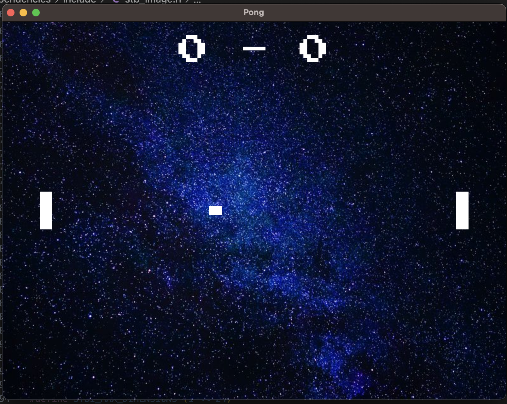

# Pong Game

## Table of Contents

- [About](#about)
- [Features](#features)
- [Dependencies](#dependencies)
- [Installation](#installation)
- [How to Play](#how-to-play)
- [Controls](#controls)

## About

Pong Game is a simple implementation of the classic Pong arcade game using modern C++ and OpenGL. This project serves as an example of game development using the GLFW library for window management and FreeType for text rendering. It was created as a learning exercise and can be used as a starting point for further game development projects.

## Features

- Classic Pong gameplay with two paddles and a bouncing ball.
- Score tracking for both players.
- Game over screen with the option to restart the game.
- Hadouken

## Dependencies

Before running this game, make sure you have the following dependencies installed on your system:

- [GLFW](https://www.glfw.org/): A multi-platform library for creating windows with OpenGL contexts.
- [FreeType](https://www.freetype.org/): A software font engine that is used for text rendering.
- [glad]()
- [glm]()
- [KHR]()
- [ft2build]()
- [stb_image]()

## Installation

1. Clone this repository to your local machine
2. Compile the code by using ctrl+shift+b if on vscode, or you own way in case using another IDE
3. Run: ./app

## How to Play

- The game starts with a bouncing ball and two paddles on the screen.
- Use the controls mentioned in the Controls section to move the paddles.
- The objective is to prevent the ball from hitting the edges of the screen and to bounce it back toward your opponent's side.
- Score points by getting the ball past your opponent's paddle.
- The game continues until one player reaches the specified score limit or until you quit.

## Controls
- Player 1 (Left Paddle):
  - Move Up: W
  - Move Down: S
- Player 2 (Right Paddle):
  - Move Up: Up Arrow
  - Move Down: Down Arrow
- Start Game: Enter
- Restart Game: R (once finished)
